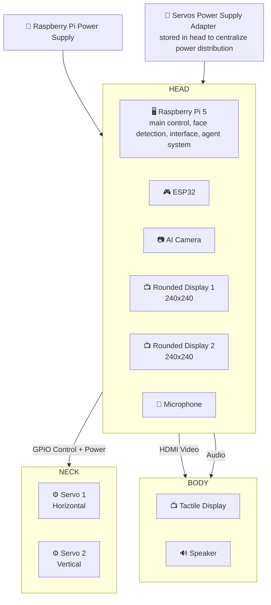
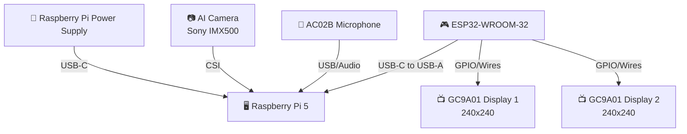
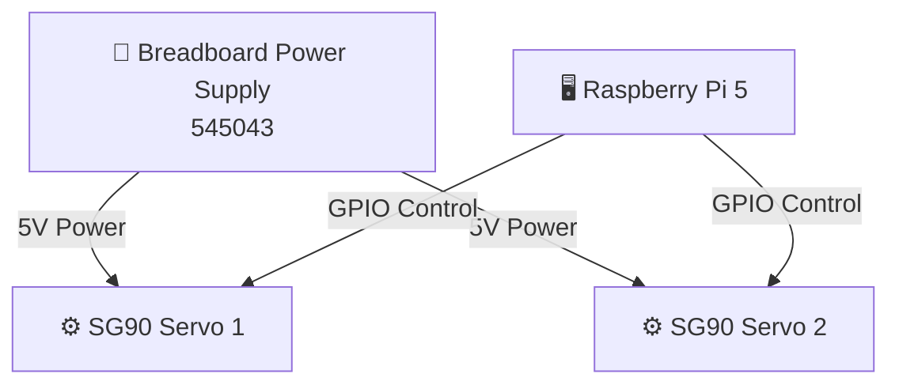
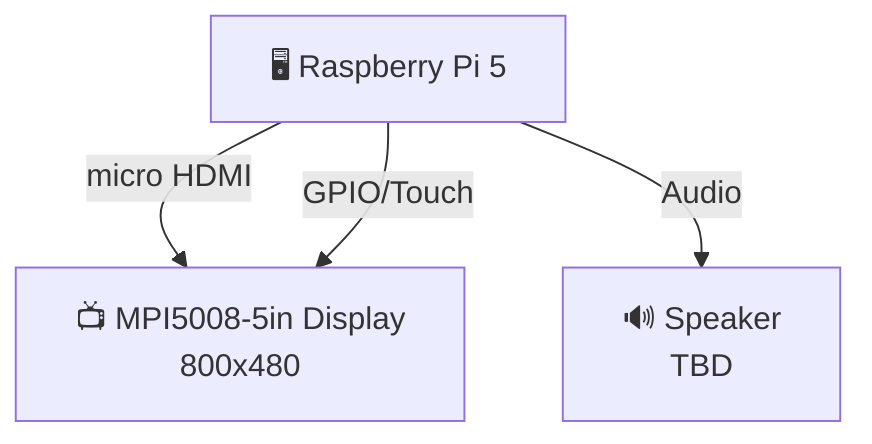

# CAP - ROBOT BODY

## OVERVIEW

Cap is the AI-powered assistant of [Flots app](https://flots.app). Its main purpose is to help users with their daily tasks and provide a friendly interface for interacting with the app.

The goal of this project is to give a physical form to Cap, allowing users to interact with it in a more natural and engaging way.

## RASPBERRY PI SETUP

From total scratch with a fresh Raspberry Pi OS light installation

### 1. Global updates and dependencies

```bash
sudo apt update && sudo apt upgrade -y
sudo apt install git-all -y
ssh-keygen -t ed25519 -C "your_email@example.com"
cat ~/.ssh/id_ed25519.pub
```

Copy the output of the last command and add it to your GitHub account (Settings > SSH and GPG keys > New SSH key)

Allow SSH access to the Raspberry Pi from your computer:

```sh
sudo systemctl enable --now ssh
```

SSH command on your remote computer:

```sh
ssh cap@192.168.10.127 # password: cap
```

### 2. Specific dependencies for the project

```bash
sudo apt install python3-pip python3-venv
```

#### Clone the repository

```bash
git clone
```

#### Install ai-camera dependencies

Read the [ai-camera README](./ai-camera/README.md) for instructions on how to set up the camera and load models.

#### Control eyes via serial

Read the [eyes README](./eyes/README.md) for instructions on how to control the eyes via serial protocol.

## Components

### Overview



### List

#### HEAD

| Title | Description | Links |
|-------|-------------|-------|
| Raspberry Pi 5 8GB | Main computing unit | [Specs](./DOCS/RASPBERRY_PI_5.pdf) |
| Raspberry Pi AI Camera with Sony IMX500 | Vision module | [Specs](./DOCS/RASPBERRY_PI_CAMERA.pdf) |
| ESP32-WROOM-32 Development Board USB-C (NodeMCU-32S) | Microcontroller for eye displays | [Datasheet](./DOCS/esp32-wroom-32d_esp32-wroom-32u_datasheet_en.pdf) |
| 2 x GC9A01 1.28" TFT LCD Display Module | Eye displays, 240x240 pixels | [Datasheet](./DOCS/GC9A01%20DataSheet%20V1.1.pdf) |
| AGPTEK Microphone Module (AC02B Mini Lapel Microphone) | Audio input | - |

**Connections**

- USB-C to USB-C cable -> Raspberry Pi 5 Charging port
- Raspberry Pi Power Supply -> USB-C to USB-C cable, Female port
- USB-C to USB-A cable -> ESP32 USB-C port to Raspberry Pi USB-A port
- Wires to connect the GC9A01 displays to the ESP32

**Diagram**



#### NECK

| Title | Description | Links |
|-------|-------------|-------|
| 2 x SG90 180° Servo Motor | Head movement control, GPIO controlled | - |
| Elegoo 545043 Breadboard Power Supply (5V/3.3V) | Power distribution, stored in head | [Specs](./DOCS/breadboard-datasheet.pdf) |
| AUKRU 5V/3A Power Supply Adapter | Power supply for breadboard | - |

**Connections:**
- Power Supply 5V/3A -> Breadboard Power Supply
- Wires to connect the SG90 servos to the Breadboard Power Supply and Raspberry Pi GPIO

**Diagram**



#### BODY

| Title | Description | Links |
|-------|-------------|-------|
| MPI5008-5 inch 800x480 Tactile LCD Display Module | Main display with touch | [LCD Wiki](https://www.lcdwiki.com/5inch_HDMI_Displayn), [LCD Wiki Alt](https://www.lcdwiki.com/5inch_HDMI_Display) |
| Speaker (TBD) | Audio output | - |

**Connections**
- micro HDMI to HDMI cable -> Raspberry Pi micro HDMI port to Display Module HDMI port
- Wires to connect the Display Module (alimentation, tactile) to the Raspberry Pi GPIO

**Diagram**


### 3D Models

TBD