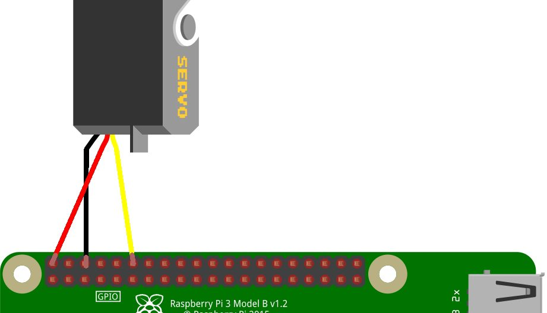

# Servo-motor control

Related info for the servo-motor control module.

## Hardware setup

The servo-motor is connected to the Raspberry Pi 5 as follows:

- **GPIO Pin 18** (6th pin from the top left) is used for the PWM signal to control the servo.
- The servo's power and ground are connected to the appropriate pins on the Raspberry Pi (usually 5V and GND).



Source https://raspberry-pi.fr/servomoteur-raspberry-pi/ for more details on the wiring and setup

## Extreme values

With the following code, it is necessary to respect the extreme values of the servo-motor, otherwise it may be damaged.

`MAX_POS=0` and `MIN_POS=-1.8` are the limits of the servo-motor's range of motion.

```python
def set_pos(p):
  if p < -1.8 or p > 0:
    print("Value out of range [-1.8, 0]. Rejected to protect the hardware.")
    return

  # p ranges from -1.8 (left) to 0 (right)
  width = 1500 + (p * 500)

  # 1. Send PWM signal to move the servo
  lgpio.tx_pwm(h, GPIO_PIN, 50, (width / 20000.0) * 100.0)
  
  # 2. Wait for the servo to physically reach its destination
  time.sleep(0.5) 
  
  # 3. Cut the signal to prevent jitter
  lgpio.tx_pwm(h, GPIO_PIN, 0, 0)
```